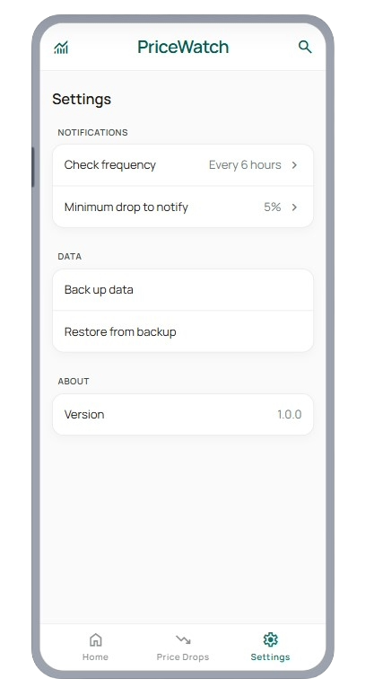

# Fiyat Takip

Kişisel kullanım için 50'den fazla e-ticaret sitesinden ürün fiyatlarını otomatik takip eden Flutter uygulaması. Tüm veri cihazda saklanır, arka planda otomatik fiyat kontrolü yapılır.




## Özellikler

- **50+ Site Desteği**: Trendyol, Hepsiburada, N11 gibi popüler siteler dahil 50'den fazla e-ticaret sitesi
- **Akıllı Scraping**: HTTP → Puppeteer (Chrome) → WebView (gerçek mobil tarayıcı) şeklinde üç kademeli fallback zinciri
- **Otomatik Fiyat Takibi**: Arka planda periyodik fiyat kontrolü
- **Fiyat Düşüş Bildirimleri**: Fiyat düştüğünde anlık bildirim
- **Fiyat Geçmişi Grafikleri**: Ürün fiyatlarının zaman içindeki değişimi
- **Paylaşımdan Ekleme**: Tarayıcıdan direkt link paylaşımı ile ürün ekleme
- **Veri Yedekleme**: JSON formatında export/import desteği
- **Hedef Fiyat Belirleme**: İstediğiniz fiyata ulaşıldığında bildirim
- **Ürün Gruplama**: Aynı ürünün farklı sitelerdeki fiyatlarını karşılaştırma
- **Grup Karşılaştırma**: En ucuz ürünü ⭐ rozeti ile vurgulama, site renk kodları
- **Canlı Arama & Filtreleme**: Ürün adı, site adı ve etiketlere göre anında filtreleme
- **Ürün Düzenleme**: Hedef fiyat, notlar ve grup ataması düzenlenebilir
- **Görsel Scraping**: Ürün görsellerini otomatik çekme (webp, jpg, png formatları)

## Scraping Mimarisi

Uygulama 3 kademeli bir scraping zinciri kullanır:

```
Site-specific Scraper → Generic HTML Scraper → Smart Fallback (Puppeteer) → WebView
```

1. **Site-specific scrapers**: Her site için özel yazılmış scraper (Trendyol, Hepsiburada, N11, LCW, Nike, Mavi vb.)
2. **Generic HTML Scraper**: HTTP istekleriyle genel HTML parsing (JSON-LD, meta tag, DOM seçiciler)
3. **Smart Fallback Scraper**: HTTP başarısız olursa Puppeteer (headless Chrome) dener
4. **WebView Scraper**: Son çare olarak gerçek mobil tarayıcı (Cloudflare/Akamai korumalı siteleri geçer)

### Desteklenen Siteler (30+/50 HTTP ile çalışır)

Trendyol, Hepsiburada, N11, Amazon, LC Waikiki, MediaMarkt, Nike, Mavi, Defacto, Koton, IKEA, Migros, Şok Market, Gratis, Rossmann, Flo, Pazarama, eBay, Walmart ve daha fazlası.

> ⚠️ **Uyarı**: Bu uygulama kişisel kullanım içindir. Web scraping işlemi, ilgili web sitelerinin kullanım koşullarına tabidir. Sitenin `robots.txt` dosyasına ve kullanım koşullarına uygun hareket edilmesi önerilir.

## Teknoloji Stack

| Katman | Teknoloji |
|--------|-----------|
| State Management | Riverpod |
| Veritabanı | Drift (SQLite) |
| Scraping | http, html, puppeteer |
| Arka Plan Görevleri | workmanager |
| Bildirimler | flutter_local_notifications |
| Grafikler | fl_chart |
| Paylaşım | receive_sharing_intent, share_plus |
| Routing | go_router |

## Kurulum

### Gereksinimler

- Flutter SDK >= 3.11.1
- Dart SDK >= 3.11.1

### Adımlar

1. Depoyu klonlayın:
```bash
git clone <repository-url>
cd fiyat_takip
```

2. Bağımları yükleyin:
```bash
flutter pub get
```

3. Code generation için build_runner çalıştırın:
```bash
flutter pub run build_runner build --delete-conflicting-outputs
```

4. Uygulamayı çalıştırın:
```bash
flutter run
```

## Kullanım

### Ürün Ekleme

**Manuel Ekleme:**
1. Ana sayfada ➕ butonuna tıklayın
2. Ürün linkini yapıştırın
3. Uygulama otomatik ürün bilgilerini çeker
4. İsteğe bağlı: hedef fiyat, not ekleyin
5. "Ürün Ekle" butonuna tıklayın

**Paylaşımdan Ekleme:**
1. Tarayıcıda veya uygulamada "Paylaş" seçeneğini kullanın
2. Fiyat Takip uygulamasını seçin
3. Link otomatik olarak ürün ekleme ekranına yönlendirilir

### Ürün Gruplama

Aynı ürünün farklı sitelerdeki fiyatlarını karşılaştırmak için grupları kullanın.

**Grup Oluşturma:**
1. Ana sayfada 📁 (Gruplarım) butonuna tıklayın
2. ➕ "Grup Oluştur" butonuna tıklayın
3. Grup adını girin (örn: "Sony WH-1000XM5")

**Ürünü Gruba Ekleme:**
- **Yeni ürün eklerken**: Grup karşılaştırma sayfasında "Link Ekle" butonunu kullanın
- **Mevcut ürünü düzenlerken**: Ürün detay → Düzenle → Grup seç

**Grup Karşılaştırma:**
- Tüm ürünler aynı ekranda listelenir
- ⭐ **En Ucuz** rozeti en düşük fiyatlı ürünü vurgular
- 🟠🔵🔴 Renkli noktalar siteyi belirtir (Trendyol, Hepsiburada, N11)
- 📉 Yeşil badge fiyat düşüş yüzdesini gösterir
- 🔗 Her ürün için site linkine tıklayabilirsiniz
- 🔍 Grup içinde arama yapabilirsiniz

### Arama & Filtreleme

**Ana Sayfa:**
- Ürün adı, site adı veya etiketlere göre anında arama
- 🔧 Filtre → "Sadece İndirimleri Göster"
- Aktif filtre chip olarak gösterilir, ✕ ile kaldırılır

**İndirimler Sayfası:**
- 🔍 Arama diyalogu ile indirimli ürünlerde arama

### Fiyat Takibi

Uygulama arka planda otomatik olarak fiyatları kontrol eder. Kontrol sıklığını ayarlardan değiştirebilirsiniz:
- 1 saat
- 3 saat
- 6 saat
- 12 saat
- 24 saat

### Bildirimler

Fiyat düşüşü tespit edildiğinde bildirim alırsınız. Bildirim formatı:
```
Ürün adı: 450₺ → 380₺ (%15 düşüş)
```

Hedef fiyat belirlediyseniz ve bu fiyata ulaşıldığında öncelikli bildirim alırsınız.

### Veri Yedekleme

**Backup:**
1. Ayarlar ekranına gidin
2. "Backup Data" seçeneğini seçin
3. Veriler JSON formatında paylaşılır

**Restore:**
1. Ayarlar ekranına gidin
2. "Restore Data" seçeneğini seçin
3. Backup dosyasını seçin

## Proje Yapısı

```
lib/
├── core/
│   ├── database/           # Drift veritabanı ve tablolar (SQLite)
│   ├── background/         # Workmanager ile arka plan fiyat kontrolü
│   ├── notifications/      # Flutter local notification servisi
│   ├── localization/       # Çoklu dil desteği (EN/TR)
│   ├── theme/              # Material 3 tema konfigürasyonu
│   └── providers/          # Riverpod dependency injection
├── features/
│   ├── products/
│   │   ├── domain/         # Entity (Product, PriceHistory, ProductGroup)
│   │   ├── data/           # Scrapers, repository, data source
│   │   └── presentation/  # Ekranlar, provider'lar, widget'lar
│   ├── groups/             # Grup karşılaştırma ve grup listesi
│   └── settings/           # Ayarlar, yedekleme, dil seçimi
└── shared/                 # Ortak widget'lar (ProductCard, AppBar, EmptyState)
```

## Site Scraping

Uygulama **genel amaçlı** bir scraping sistemidir - sadece belirli siteler için değil, herhangi bir e-ticaret sitesinden link ekleyebilirsiniz.

### Genel Scraping Akışı

**Herhangi bir URL eklendiğinde sistem otomatik olarak:**

1. **Site-Specific Scraper Kontrolü**
   - Trendyol → TrendyolScraper (HTTP tabanlı, optimize edilmiş)
   - Hepsiburada → HepsiburadaScraper (Puppeteer tabanlı, anti-bot bypass)
   - N11 → N11Scraper (Puppeteer tabanlı, anti-bot bypass)
   - Diğer tanımlı siteler için özel scraper'lar

2. **Puppeteer Fallback** (Tüm siteler için)
   - Site-specific scraper yoksa veya başarısız olursa
   - Amazon, AliExpress, eBay, diğer tüm e-ticaret siteleri
   - JavaScript execution, Cloudflare bypass, popup handling
   - **Bu sayede yeni site eklemeden de çalışır**

3. **Generic HTML Scraper** (Son çare)
   - Puppeteer de başarısız olursa
   - Basit HTML parsing teknikleri

### Desteklenen Siteler

**Doğrudan Optimize Edilmiş:**
- ✅ Trendyol (HTTP tabanlı, hızlı)
- ✅ Hepsiburada (Puppeteer tabanlı, anti-bot bypass)  
- ✅ N11 (Puppeteer tabanlı, anti-bot bypass)

**Puppeteer ile Otomatik Desteklenen:**
- ✅ Amazon
- ✅ AliExpress
- ✅ eBay
- ✅ Diğer tüm e-ticaret siteleri

**Desteklenmeyen Siteler:**
- ❌ Sahibinden.com (Çok güçlü anti-bot koruması nedeniyle scraping mümkün değil)

### Kullanım Örnekleri

```dart
// Amazon linki ekleyebilirsin
final amazonUrl = 'https://www.amazon.com/product-url';
// → Site-specific scraper yok → Puppeteer devreye girer → Başarılı! ✅

// AliExpress linki ekleyebilirsin
final aliexpressUrl = 'https://www.aliexpress.com/item/url';
// → Site-specific scraper yok → Puppeteer devreye girer → Başarılı! ✅

// Trendyol linki ekleyebilirsin
final trendyolUrl = 'https://www.trendyol.com/product-url';
// → TrendyolScraper çalışır → Başarılı! ✅
```

### Scraping Hiyerarşisi

1. **Site-Specific Scrapers**: Her site için optimize edilmiş scraper'lar
   - Trendyol için HTTP tabanlı (hızlı)
   - Hepsiburada ve N11 için Puppeteer tabanlı (anti-bot bypass)
   - Daha hızlı ve verimli çalışır

2. **Puppeteer (Headless Chrome)**: Genel amaçlı güçlü scraper
   - JavaScript execution desteği
   - Cloudflare ve diğer anti-bot korumalarını bypass edebilir
   - JSON-LD, meta tags ve DOM selector'ları ile data extraction
   - Cookie consent popup'larını otomatik kapatma
   - Gerçekçi browser simulation (user agent, viewport, headers)
   - Görsel URL çıkarma (webp, jpg, png formatları)

3. **Generic HTML Scraper**: Fallback yöntem
   - Bilinmeyen siteler için genel scraping
   - Standart HTML parsing teknikleri

### Puppeteer Özellikleri

Puppeteer scraper modern e-ticaret sitelerinde başarılı şekilde çalışmaktadır:

- **Cloudflare Bypass**: Headless Chrome ile JavaScript challenge'ları çözebilir
- **Anti-Detection**: Automation indicators'ları gizler, gerçekçi browser davranışı
- **Popup Handling**: Cookie consent ve modal popup'ları otomatik kapatır
- **Multi-Strategy Data Extraction**:
  - JSON-LD (en güvenilir)
  - Meta tags
  - DOM selector'lar
  - @graph yapısı desteği
- **Görsel Scraping**: webp, jpg, png formatları için kapsamlı seçiciler
- **Hibrit Yaklaşım**: JSON-LD ve DOM scraping kombinasyonu

### Test Edilen Siteler

Aşağıdaki sitelerde scraping başarıyla test edilmiştir:

- ✅ **Trendyol**: HTTP scraping, JSON-LD data extraction, price/name/görsel alımı başarılı
- ✅ **Hepsiburada**: Puppeteer scraping, JSON-LD data extraction, price/name/görsel alımı başarılı
- ✅ **N11**: Puppeteer scraping, JSON-LD data extraction, price/name/görsel alımı başarılı

### Yeni Site Ekleme

**Zorunlu değil ama optimize etmek isterseniz:**

Yeni bir site için özel scraper eklemek:

1. `lib/features/products/data/scrapers/impl/` altında yeni scraper sınıfı oluşturun
2. `ProductScraper` interface'ini implement edin
3. `lib/core/providers/providers.dart` içine provider ekleyin
4. `scraperRegistryProvider` içine scraper'ı kaydedin

**Alternatif olarak:**
Puppeteer scraper otomatik olarak bilinmeyen siteleri de handle eder, bu yüzden yeni site eklemek zorunlu değildir.

## Geliştirme

### Scraping Testleri

Proje farklı scraping yöntemlerini test etmek için script'ler içerir:

```bash
# Basit HTTP scraping testi
dart run test_scrapers.dart

# Puppeteer (headless Chrome) scraping testi
dart run test_scrapers_puppeteer.dart
```

Bu test script'leri scraping stratejilerini geliştirmek ve debug etmek için kullanılabilir.

### Test Çalıştırma

```bash
flutter test
```

### Kod Analizi

```bash
flutter analyze
```

### Formatlama

```bash
dart format .
```

## Platform Spesifikasyonları

### Android
- Minimum SDK: 21
- Arka plan görevleri: 15 dakika minimum aralık
- Pil optimizasyonu: Battery not low constraint

### iOS
- Background task: BGAppRefreshTask (best-effort)
- Ek olarak foreground'a döndüğünde refresh
- Pil optimizasyonu otomatik

## Sınırlamalar

- Backend bulut senkronizasyonu yok (tüm veri cihazda saklanır)
- Cihazlar arası otomatik senkronizasyon yok
- Kullanıcı hesabı/giriş sistemi yok
- iOS'de arka plan çalışma garantisi yok (BGAppRefreshTask best-effort)
- Arşivleme özelliği kaldırıldı (ürünler ya aktiftir ya silinir)

## Gelecek Özellikler

- [ ] WebView scraper'lar için detaylı test
- [ ] Farklı ülke siteleri için desteği genişletme
- [ ] Fiyat trend analizi (30/90 günlük grafikler)
- [ ] Birden fazla cihaz senkronizasyonu
- [ ] Widget desteği (iOS/Android ana ekran widget'ı)
- [ ] Karanlık tema iyileştirmeleri

## Lisans

Bu proje kişisel kullanım için geliştirilmiştir.

Sorular ve öneriler için GitHub issues kullanabilirsiniz.
